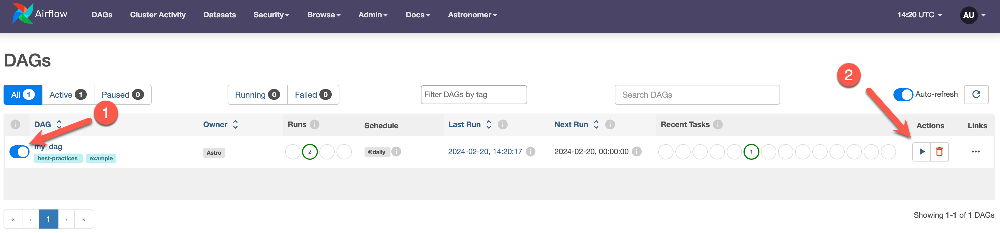

# An Astro project to run within GitHub Codespaces

Welcome to [Astronomer](astronomer.io)! :rocket:

This repository is an Astro project, a local [Apache Airflow](https://airflow.apache.org/) project created with the OSS [Astro CLI](https://docs.astronomer.io/astro/cli/overview), that you can run within GitHub codespaces. You can fork this repository to develop your own Apache Airflow projects without the need for any local setup.

## Setting up

Run this Airflow project without installing anything locally.

1. Fork this repository.
2. Create a new GitHub codespaces project on your fork by clicking **...** and **New with options**. Make sure it uses at least 4 cores!

    

    

3. Wait for the codespaces project to start. Once it has started, open a new terminal and run the following command:

    ```bash
    astro dev start
    ```

4. Once the Airflow project has started access the Airflow UI by clicking on the **Ports** tab and opening the forward URL for port 8080.

    

5. Log in to the Airflow UI using the credentials `admin` and `admin`.

    

6. You can now start developing your Airflow project within GitHub codespaces! Run DAGs by toggling them on in the Airflow UI and clicking the Run arrow. There is one example DAG in the `dags` folder that you can run out of the box.

    


## Resources

- [ask.astronomer.io](ask.astronomer.io) - Airflow + Astro knowledgeable chat application (free, OSS)
- [registry.astronomer.io](registry.astronomer.io)  - All you need to know about modules and providers (free)
- Cloud IDE - Notebook-style DAG writing, with AI✨ (free trial: [astronomer.io/try-astro](https://www.astronomer.io/try-astro))
- [Astro CLI Docs](https://docs.astronomer.io/astro/cli/overview) - The easiest way to run Airflow locally (free, OSS)
- [Astronomer Learn](https://docs.astronomer.io/learn) - Many Airflow guides and tutorials (free)
- [Astronomer Events](https://astronomer.io/events) - Add to your calendar to never miss an event/webinar (free)
- [Airflow Slack](apache-airflow-slack.herokuapp.com) - The best place to ask Airflow questions (free)